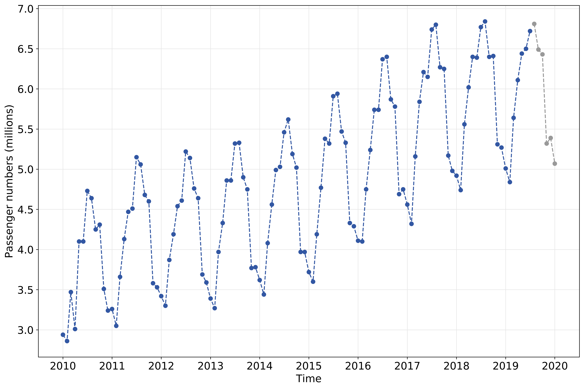

# Using Facebook's prophet to predict Schiphol passenger numbers

Here I'll introduce a straightforward application of [facebook's prophet package](https://facebook.github.io/prophet/) by using it to predict airport passenger numbers through Schiphol airport.

## Introduction to Prophet

Time series datasets are omniprescent; whether we are charting the daily close price of a stock, the population decrease of a species, or the sales of a certain product, we are recording some variable of interest at (ir)regular time intervals to observe and, hopefully, understand how it is affected by time. The ultimate goal of course is forecasting, we'd like to measure our variable of interest (stock price, population, sales) for a while and then use that data to predict the value our variable will take in the next minute/month/millenium.

Perhaps the most well known time series model is the *Autoregressive integrated moving average* or ["ARIMA"](https://en.wikipedia.org/wiki/Autoregressive_integrated_moving_average) model. Simply put, auto-regressive models are built on the idea that for time series data, the value of a variable at a given time is a function of the values it held at previous times. This idea is rather intuitive to us; if the average temperature at 2pm was 28°C, the temperature at 3pm is more likely to be 29°C than -1°C. However, it can be difficult for such models to capture seasonality ([as demonstrated in the prophet paper itself](https://peerj.com/preprints/3190/#) ). For example, though the temperature in the previous hours might well be sufficient for us to estimate the following hour's temperature, we also know that seasonal effects (day is warmer than night, winter is colder than summer) have a huge influence.

Realizing the importance of such features, the prophet model has seasonality built-in *a priori*. It takes a completely different tack from ARIMA and related models and more closely resembles a curve fitting exercise. Concretely, prophet decomposes a time series *y(t)* as follows:

Here, *g(t)* is the trend function capturing non-periodic changes, *s(t)* represents periodic changes (e.g. daily/weekly/yearly seasonality), *h(t)* represents the effects of holidays, and &#1013;*t* is a normally distributed error term.

Ok, enough of the introduction to prophet, please read [the paper itself](https://peerj.com/preprints/3190/#) for further details. Let's crack on with our example.

## Schiphol passenger data

Schiphol monthly passenger data is freely available from the [Schiphol website](https://www.schiphol.nl/en/schiphol-group/page/transport-and-traffic-statistics/), and though there are several interesting figures published, we'll be inerested in the value labelled *Passengers (incl transit-direct)*. Let's take a quick look at the data:

  

