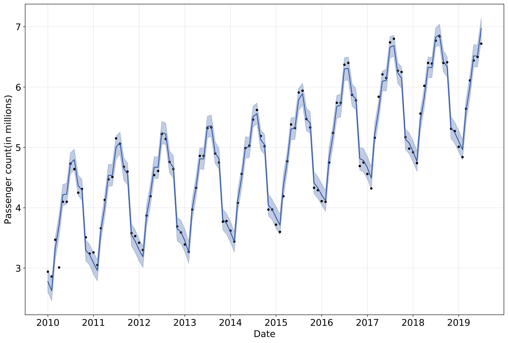

# Using Facebook's prophet to predict Schiphol passenger numbers

Here I'll introduce a straightforward application of [facebook's prophet package](https://facebook.github.io/prophet/) by using it to predict airport passenger numbers through Schiphol airport.

## Introduction to Prophet

Time series datasets are omniprescent; whether we are charting the daily close price of a stock, the population decrease of a species, or the sales of a certain product, we are recording some variable of interest at (ir)regular time intervals to observe and, hopefully, understand how it is affected by time. The ultimate goal of course is forecasting, we'd like to measure our variable of interest (stock price, population, sales) for a while and then use that data to predict the value our variable will take in the next minute/month/millenium.

Perhaps the most well known time series model is the *Autoregressive integrated moving average* or ["ARIMA"](https://en.wikipedia.org/wiki/Autoregressive_integrated_moving_average) model. Simply put, auto-regressive models are built on the idea that for time series data, the value of a variable at a given time is a function of the values it held at previous times. This idea is rather intuitive to us; if the average temperature at 2pm was 28°C, the temperature at 3pm is more likely to be 29°C than -1°C. However, it can be difficult for such models to capture seasonality ([as demonstrated in the prophet paper itself](https://peerj.com/preprints/3190/#) ). For example, though the temperature in the previous hours might well be sufficient for us to estimate the following hour's temperature, we also know that seasonal effects (day is warmer than night, winter is colder than summer) have a huge influence.

Realizing the importance of such features, the prophet model has seasonality built-in *a priori*. It takes a completely different tack from ARIMA and related models and more closely resembles a curve fitting exercise. Concretely, prophet decomposes a time series *y(t)* as follows:

Here, *g(t)* is the trend function capturing non-periodic changes, *s(t)* represents periodic changes (e.g. daily/weekly/yearly seasonality), *h(t)* represents the effects of holidays, and &#1013;*t* is a normally distributed error term.

Ok, enough of the introduction to prophet, please read [the paper itself](https://peerj.com/preprints/3190/#) for further details. Let's crack on with our example.

## Schiphol passenger data

Schiphol monthly passenger data is freely available from the [Schiphol website](https://www.schiphol.nl/en/schiphol-group/page/transport-and-traffic-statistics/), and though there are several interesting figures published, we'll be inerested in the value labelled *Passengers (incl transit-direct)*, for which data is available from January 2010 until January 2020. Let's take a quick look at the data:

  

There are a two key things to note about the behaviour of passenger numbers displayed here:

 - Seasonality. We see clear seasonality in the behaviour of passenger numbers, for example passengers seem to travel more frequently in summer months. You might also be able to convince yourself of an uptick in December and January related to Christmas travel.
 
 - Trend. Passenger numbers can be seen to be steadily increasing, with this increase possibly flattening-out over recent years. 
 
 These two behaviours are, as we explained, already built into prophet, so this should be a great example problem for it to solve. 
 
 Note finally the colour difference of the last 6 data points, we've plotted them in grey to denote the fact that these are the points we're going to ask prophet to predict later on. In the notebook you'll see that the number of held back months can easily be varied, and you might want to play around with it to see how prophet fares when predicting further or nearer into the future.
 
 ## Modelling Passenger numbers with Prophet
 
 Let's get started with prophet, note all the code to generate the following figures is included in the [notebook](https://github.com/Yoyodyne-Data-Science/schiphol-passengers/blob/master/Schiphol_Passengers.ipynb), and I've provided the monthly data in a clean csv [schiphol_millions_pax_monthly.csv](https://github.com/Yoyodyne-Data-Science/schiphol-passengers/blob/master/data/schiphol_millions_pax_monthly.csv).
 
 ### Installing prophet
 
 Sometimes the installation of prophet isn't so straightforward, I've put some helpful tips and links in the markdown [notes_on_prophet_installation.md](https://github.com/Yoyodyne-Data-Science/schiphol-passengers/blob/master/notes_on_prophet_installation.md)
 
 ### Understanding patterns in the data
 
 Remember that we held out the final 6 months of data so that we can see how good prophet is at predicting unseen data. This is the equivalent of a test dataset in the usual parlance of data science train-test splits. Before trying to predict those data points and evaluating the correctness of such a prediction, let's first fit prophet on the training data itself. Though this might feel like quite a strange thing to do, as typically we are interested in how a model performs on unseen data (knowing from experience that models can perform arbitrarily well on training data, e.g. see ["overfitting"](https://en.wikipedia.org/wiki/Overfitting)), it is quite common in time series analysis, e.g. see ["backtesting"](https://en.wikipedia.org/wiki/Backtesting). Such a fit typically allows us to isolate -- and hopefully, understand -- patterns in historic data.
 
 Perhaps we could say that the benefits of such a backtesting are only apparent when we have a model with a high bias. That is, when we have made quite a few assumptions as to how our timeseries should be behaving, our backtest will confirm our initial beliefs and tell us in detail the resulting values of (well understood) parameters on our data. Whereas conversely, fitting a high variance model on the training set probably won't tell us too much; it will likely perfectly (over)fit the training data, and we'll have little idea how to interpret the parameters (think of fitting a lasso regression vs a huge random forest on a dataset).
 
 Anyway, we're getting off-topic somewhat. The prophet model has a lot of assumptions built in; namely seasonality and trend, so we can convince ourselves that fitting it on our training data will gives us a good idea of how season and trend are effecting passenger numbers in our data.
 
 Let's have a look at the training data (i.e. all data bar the last 6 months) fit with prophet:
 
 

  

